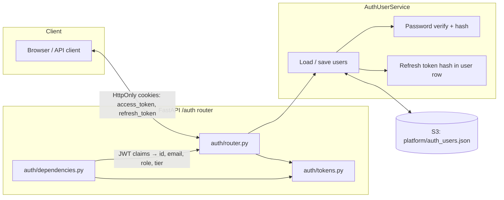
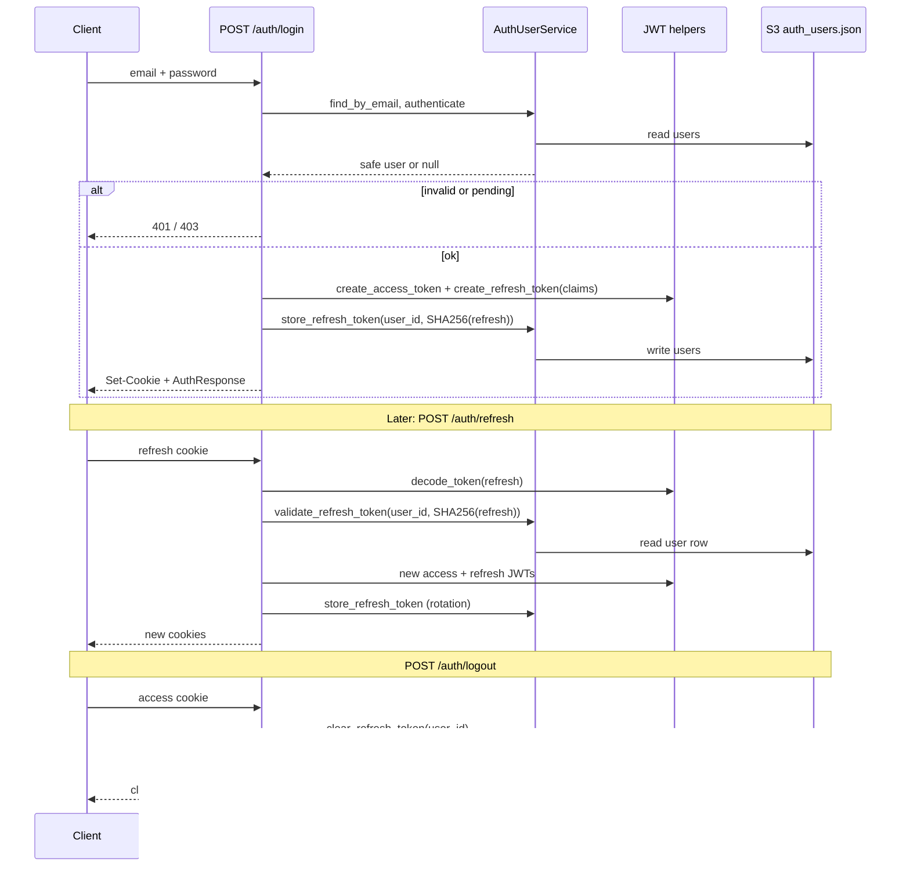
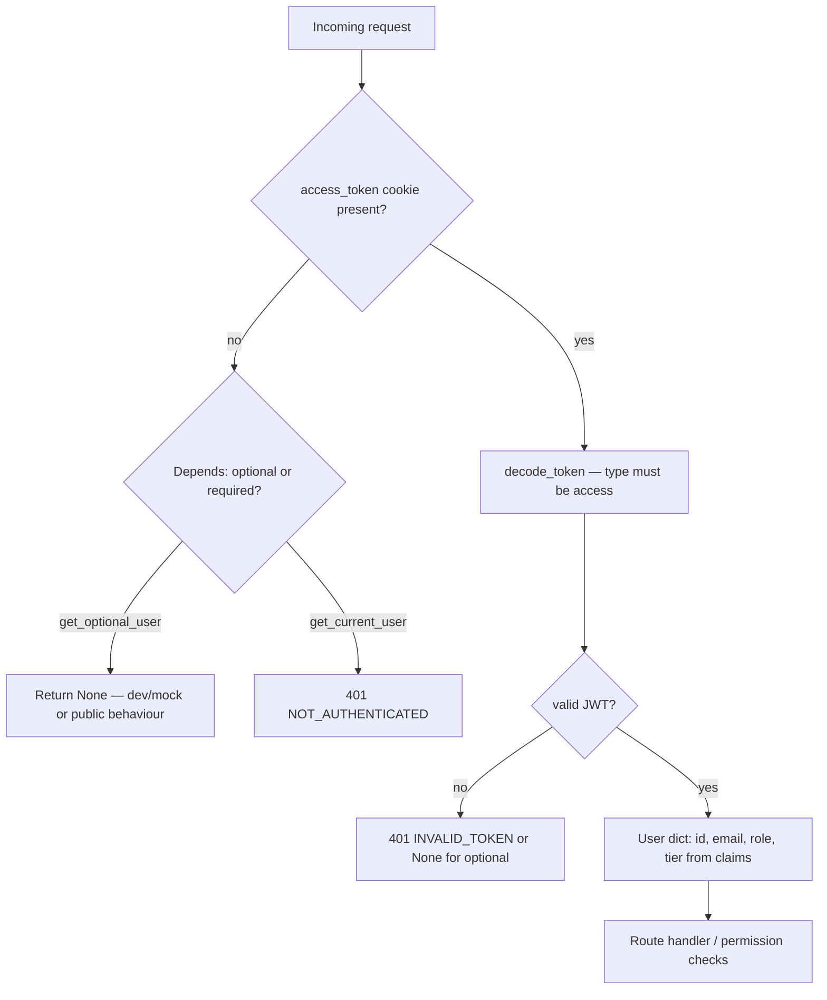
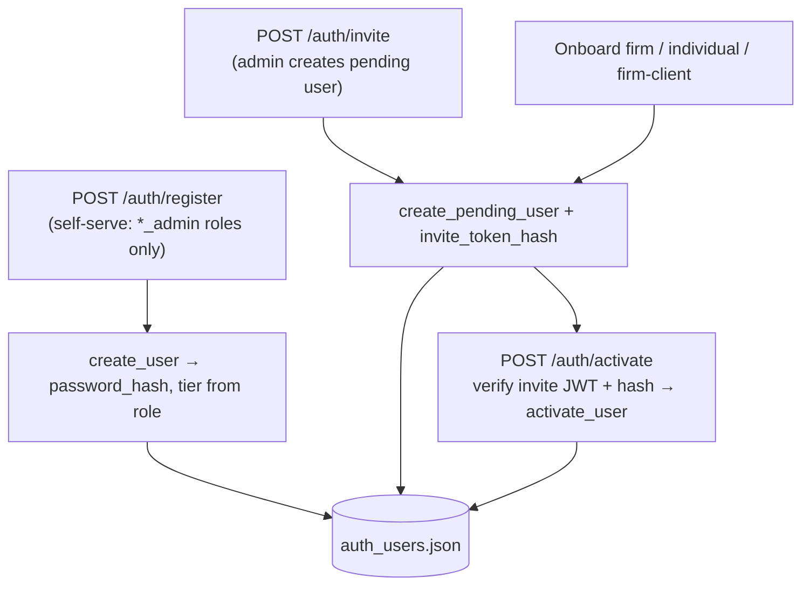

# Auth module

This folder implements cookie-based JWT authentication backed by S3. User records (including password hashes, role, and derived **tier**) live in **`platform/auth_users.json`**, managed by **`AuthUserService`**. The FastAPI **`/auth`** router issues HttpOnly cookies; **`dependencies.py`** resolves the current user from the access-token cookie for protected routes.

For how **tier** relates to roles and how this differs from **`platform/aict_users.json`**, see the main ETL/data docs or ask the team—AICT’s separate user roster is not used for login.

---

## Architecture

---

## Login, refresh, and logout

---

## Resolving the current user on each request

`get_current_user` and `get_optional_user` read the **`access_token`** cookie, decode the JWT, and require `type == "access"`. They do **not** load S3 on every request; claims carry `sub`, `email`, `role`, and `tier`. **`GET /auth/me`** reloads the user from S3 by `sub` so the response matches the latest stored profile.

---

## User lifecycle (register, invite, onboard)

---

## Key files

| File | Role |
|------|------|
| `service.py` | `AuthUserService` — CRUD, `authenticate`, refresh-token hash storage, `tier` derived from `role` |
| `router.py` | `/auth` routes: login, refresh, logout, register, invite, activate, onboarding, user admin |
| `dependencies.py` | `get_current_user`, `get_optional_user`, `require_roles` |
| `tokens.py` | Create/decode JWTs; cookie helpers |
| `passwords.py` | Hashing and verification |
| `permissions.py` | Role → permission checks for route guards |
| `role_service.py` | Canonical role definitions (tier, level, permissions metadata) |
