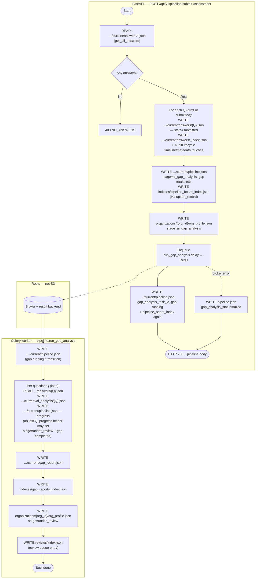

# AI assessment process (end-to-end)

This document describes how a practitioner assessment moves from saved answers through AI gap analysis and review, as implemented in this backend. It complements **`app/etl/s3/README-datastruct.md`** (S3 layout) and **`app/pipeline/README.md`** (Celery / Redis).

---

## Scope: what identifies an assessment

All pipeline and answer APIs operate on a single **audit scope**:

| Field | Constraint (API) | Meaning |
|--------|------------------|--------|
| `org_id` | Crockford ULID | Organisation |
| `audit_id` | Crockford ULID | Audit instance |
| `project_id` | 3 digits | Project under the org |
| `ai_system_id` | 4 digits | AI system under the project |

Enforcement for many routes: **`app/rest/strict_audit_ids.py`**.

---

## Pipeline stages

Order is defined in **`app/pipeline/models.py`** (`PipelineStage`):

1. **`not_started`**
2. **`in_progress`**
3. **`ai_gap_analysis`** — gap analysis running (typically async via Celery)
4. **`under_review`** — human / CSAP review
5. **`review_complete`**

Labels for UIs: `STAGE_LABELS` in the same module.

---

## Phase 1 — Save answers (per question)

**Endpoint:** `POST /api/v1/assessment/answers`

- Saves **one** answer at a time (`question_id`, `user_answer`, `state`, plus scope fields).
- Persists via **`AnswerService`** to S3 (see datastruct doc for key layout under `systems/`).

**Side effect:** If the pipeline record for this scope is still **`not_started`**, the handler tries to:

- **`ensure_record`** with stage **`in_progress`**
- Update the **org profile** `stage` to **`in_progress`**

So the first saved answer can bootstrap both the pipeline row and org-level stage without a separate init call.

---

## Phase 2 — Initialise pipeline (optional)

**Endpoint:** `POST /api/v1/pipeline/init`

- Body: same scope as **`SubmitAssessmentBody`** (`org_id`, `audit_id`, `project_id`, `ai_system_id`).
- **`ensure_record`** — creates or returns the pipeline record if missing.

Use this when you want an explicit board entry before any answer exists, or to align with a UI that calls init first.

---

## Phase 3 — Final submit (whole assessment, triggers AI)

**Endpoint:** `POST /api/v1/pipeline/submit-assessment`

- **Not** per question. Call **once** when the practitioner is done.
- **Permission:** `assessment.fill` (see **`app/auth/permissions.py`**).

**Behaviour:**

1. **`get_all_answers`** for the scope.
2. If none → `400 NO_ANSWERS`.
3. For each answer, if state is `draft` or `submitted`, **`upsert_answer`** with **`state="submitted"`** (locks answers).
4. Builds the full **`question_ids`** list from those rows.
5. Transitions pipeline to **`ai_gap_analysis`** with gap metadata (`pending` / totals / progress).
6. Updates **org profile** `stage` to **`ai_gap_analysis`** (best effort).
7. **`run_gap_analysis.delay(...)`** — enqueues **one** Celery task with **all** `question_ids`.
8. Stores **`gap_analysis_task_id`** on the pipeline record and sets gap status to **`running`** when dispatch succeeds; on dispatch failure, gap status is **`failed`**.

**Important:** Re-calling submit on an already analysed assessment is not documented as a supported “re-run” flow; guardrails would be a product decision (see Enhancements).

### Flow diagram: submit-assessment → S3 → Celery → S3

Paths below use the v2 layout from **`app/etl/s3/utils/s3_paths.py`**. Optional global **`BASE_PREFIX`** applies to every key. The long prefix is:

`organizations/{org_id}/projects/{project_id}/systems/{ai_system_id}/audits/{audit_id}/current/`

**Notes**

- **Question text** for the worker comes from **`CategoryQuestionLoader`** (local `data_dir`), not from a separate S3 question store.
- **`upsert_record`** always refreshes **`indexes/pipeline_board_index.json`**; the diagram collapses multiple writes to **`…/current/pipeline.json`** into a few steps.
- If **`run_gap_analysis.delay`** fails, the worker branch never runs; the client still gets **200** with pipeline marked **failed** (see router).

---

## Phase 4 — Background gap analysis (Celery worker)

**Task:** `pipeline.run_gap_analysis` in **`app/pipeline/tasks.py`**.

Runs in a **worker** process (`celery -A app.pipeline.celery_app worker`, or Docker **`celery-worker`**), not inside uvicorn.

**Summary of work:**

- Marks gap analysis **running** in the pipeline record.
- For each `question_id`: load answer from S3, load question text from **`CategoryQuestionLoader`**, run **`analyze_question`** (LLM / semantic pipeline), save per-question gap results, update progress.
- Writes the **aggregate gap report** to S3, updates **gap reports index**, sets org stage to **`under_review`**, adds a **review queue** entry where applicable.

**Infrastructure:** Redis as Celery broker + result backend — see **`app/pipeline/README.md`**.

---

## Phase 5 — Progress and status (polling)

| Endpoint | Purpose |
|----------|--------|
| `GET /api/v1/pipeline/status` | Pipeline record for scope (`pipeline.view`) |
| `GET /api/v1/pipeline/gap-progress` | Gap counters + optional **`celery_task_status`** from **`AsyncResult(gap_analysis_task_id)`** |

S3 fields on the pipeline record remain the source of truth for business progress; Celery status is auxiliary (and results expire in Redis after configured TTL).

---

## Phase 6 — Review completion

Review flows live under **`app/rest/v1/review.py`** and related services. Completing review transitions the pipeline toward **`review_complete`** and syncs org stage (see that router for details). This doc does not duplicate every review endpoint.

---

## Related: derived audit artifacts

**`schedule_derived_recompute`** (**`app/etl/s3/services/derived_service.py`**) may enqueue **`pipeline.recompute_derived_audit`** (placeholder **`derived/*`** JSON in S3), triggered from **audit lifecycle** code paths—not from `submit-assessment`. If Celery is unavailable, a **synchronous** stub write is used.

---

## Related: legacy / alternate APIs (not the Celery pipeline)

| Endpoint | Role |
|----------|------|
| `POST /api/v1/knowledge/gap-analysis` | Legacy KB + LLM gap-style call — **not** the same as `run_gap_analysis`. |
| `POST /api/v1/assessment/evaluate-answer` | Legacy FAISS + rubric evaluation for a single question. |

Do not assume these replace or invoke the Celery gap pipeline.

---

## Permissions (short)

- **`assessment.fill`** — save answers; **submit-assessment**.
- **`pipeline.view`** — board, init, status, gap-progress.

Other tiers may have additional rules in routers (org resolution, firm client scope).

---

## Operational checklist

1. **Redis** reachable at **`CELERY_BROKER_URL`**.
2. At least one **Celery worker** running with the same code and env as the API (S3, config, LLM keys for the analyzer).
3. **Category / question data** available to the worker (`data_dir` / config) so `question_id` → question text resolves.

---

## Possible enhancements

These are **not** implemented as first-class features today; they are reasonable follow-ups:

1. **Admin / support “re-run gap analysis”** — dedicated endpoint that re-enqueues `run_gap_analysis` with guards (stage, permissions, idempotency).
2. **Explicit submit idempotency** — reject or no-op **`submit-assessment`** if the audit is already past `ai_gap_analysis` unless a controlled retry is allowed.
3. **Webhook or SSE** — push gap-progress instead of polling `gap-progress`.
4. **Stricter alignment** — document or enforce which `state` values count as “ready to submit” (e.g. only `draft` vs `submitted` already).
5. **Observability** — structured logs / metrics on task duration and failure rate per org.

---

## File map

| Area | Location |
|------|----------|
| Save answer + first pipeline bump | `app/rest/v1/assessment.py` |
| Pipeline HTTP API | `app/pipeline/router.py` |
| Pipeline model / stages | `app/pipeline/models.py` |
| Celery tasks | `app/pipeline/tasks.py` |
| Celery app config | `app/pipeline/celery_app.py` |
| Gap analyzer entry | `app/pipeline/gap_analysis/analyzer.py` |
| Derived stub + schedule | `app/etl/s3/services/derived_service.py` |
